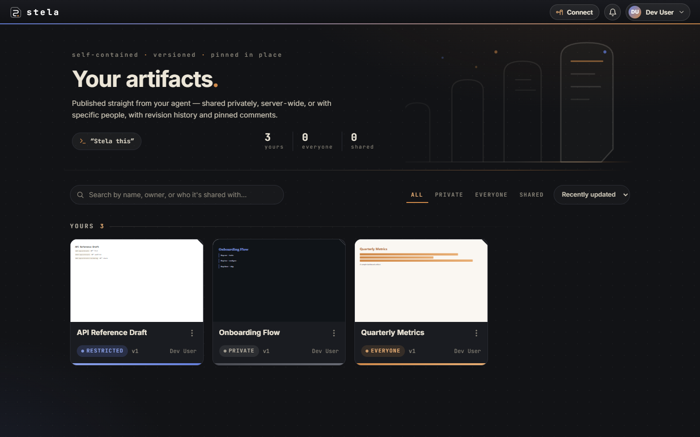
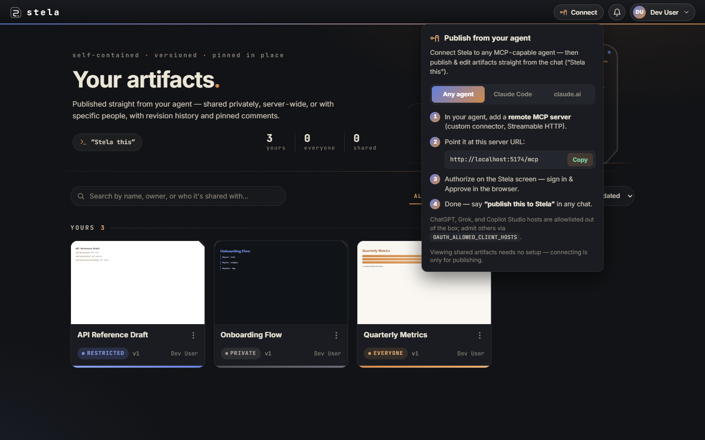
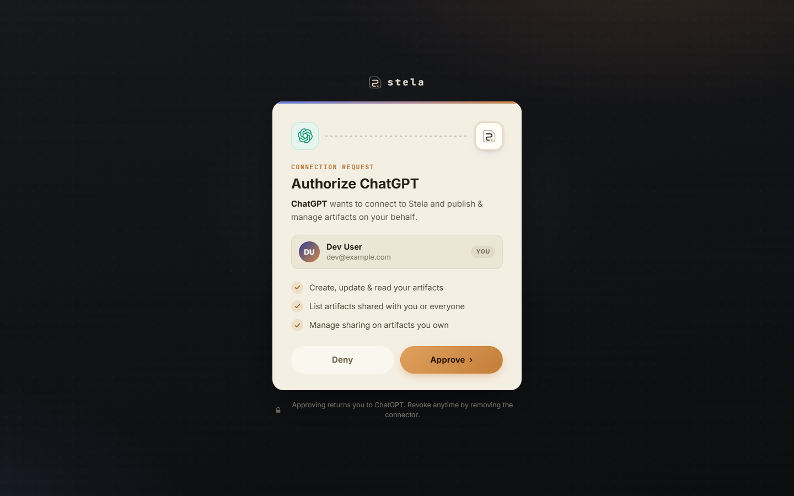

```
        ███████╗ ████████╗ ███████╗ ██╗       █████╗
        ██╔════╝ ╚══██╔══╝ ██╔════╝ ██║      ██╔══██╗
        ███████╗    ██║    █████╗   ██║      ███████║
        ╚════██║    ██║    ██╔══╝   ██║      ██╔══██║
        ███████║    ██║    ███████╗ ███████╗ ██║  ██║
        ╚══════╝    ╚═╝    ╚══════╝ ╚══════╝ ╚═╝  ╚═╝
           self-contained · versioned · pinned in place
```

<p align="center">
  
  
  
  
  
  
</p>

> **Stela** is a self-hosted home for **agent-built artifacts** — the self-contained HTML
> that AI agents produce (dashboards, prototypes, one-pagers). Any MCP-speaking agent can
> publish to it; anyone your gate admits can view, and collect **pinned visual comments**
> on a stable URL with full **revision history**. Inspired by Claude's artifacts — built
> so no vendor decides who gets to see your work.
>
> *A stela is an inscribed stone slab erected for public display. Same idea, less quarrying.*



## Why

Every AI vendor now hosts artifacts in its own silo, shared on its own terms — usually a
fully public link for the whole internet, or a seat inside the same walled garden. Neither
one is *"show this to my team, behind our own login."* And each vendor's gallery only
holds its own agent's work.

Stela is that missing middle, and stays small being it. One Node process, one SQLite
file, no accounts to manage, no cloud dependencies. Your agents — whichever vendor,
however many — publish to one place; anyone your gate admits can view, comment, and
follow along as you revise.

```
  any MCP agent ──"Stela this"──▶  publish_artifact ─▶  ┌──────────────────────────────┐
  (Claude Code / ChatGPT /                              │  Stela                       │
   Grok / Copilot / your own)                           │  · versions, immutable       │
                                                        │  · sharing, three tiers      │
                                                        │  · pinned comments 📌        │
                                                        └──────────────┬───────────────┘
                                                                       │ stable share URL
                                          your auth proxy ◀────────────┘
                                                  │
  teammate (no AI seat at all) ──opens link──▶ sandboxed iframe (no-network CSP)
                                                  │
                                       drops pinned comments ──▶ read_comments ──▶ the agent
```

## What it does

- 📤 **Publish from any agent** — "publish this to Stela" / "Stela this" in Claude Code,
  claude.ai, ChatGPT, Grok, Copilot Studio, or anything else that speaks MCP turns the
  current artifact into a hosted, shareable page.
- 🔗 **Stable URLs + revision history** — republishing creates a new immutable **version**
  at the **same URL**; every version stays viewable.
- 🔒 **Three-tier sharing** — **private** (you), **everyone** (anyone signed in to your
  server), or **restricted** (named people, by user id or email).
- 📌 **Pinned visual comments** — reviewers pin feedback to a spot on the artifact;
  threads resolve, scoped to the version they were made on.
- ♻️ **Close the loop** — `read_comments` pulls the feedback back into whatever agent
  published the thing, so it can address it and republish.
- 🛡️ **Safe rendering** — artifacts run in an opaque-origin sandboxed iframe under a
  strict `default-src 'none'` CSP: no network egress, no reach into the portal.
- 🪶 **Zero heavy dependencies** — storage is Node's built-in `node:sqlite` writing one
  file in `DATA_DIR`. Backup = copy the file. (An Azure Table/Blob driver ships too, if
  that's your thing.)

## Quick start

### Local, zero config

Requires Node ≥ 22.5 (and [pnpm](https://pnpm.io) via `npx pnpm` or `corepack`).

```bash
git clone https://github.com/kdowding/Stela
cd Stela
npx pnpm install
npx pnpm dev
```

Open http://localhost:5173 — you're signed in as a dev user, storage lives in
`packages/app/.data/`. Then connect an agent — the **Connect** button in the app walks
through each client. For Claude Code it's one command:

```bash
claude mcp add --transport http stela http://localhost:5173/mcp
```

then `/mcp` to authenticate (the consent screen opens in your browser). For ChatGPT,
Grok, claude.ai, or Copilot Studio, add Stela as a **custom connector / remote MCP
server** pointed at `http://localhost:5173/mcp` — those hosts are allowlisted out of the
box, and `OAUTH_ALLOWED_CLIENT_HOSTS` admits any other. Then say **"Stela this"** in any
chat. Even purely local, you get what a file on disk can't give you: stable URLs,
revision history, and pinned comments the agent can read back.



### Docker demo

```bash
docker compose --profile demo up
```

Open http://localhost:8080 — a bundled Caddy stamps a static demo identity on every
request. Single-user, for kicking the tires; not an auth system.

### For real

Stela **does not manage accounts** — see [Security model](#security-model). Put an
identity-aware proxy in front of the container and tell Stela which headers to trust:

```bash
ORIGIN=https://stela.example.com        # the public URL users hit
AUTH_MODE=header
AUTH_HEADER_ID=cf-access-authenticated-user-email   # whatever YOUR proxy injects
AUTH_HEADER_NAME=...                    # optional
AUTH_HEADER_EMAIL=...                   # optional
STELA_API_KEY=<long random value>       # admin/CI publishing
STORAGE_DRIVER=sqlite
DATA_DIR=/data
```

Good gates, in rough order of effort:

- **Cloudflare Tunnel + Access** — no open ports at all; free logins (Google/GitHub/email
  one-time-code) for up to 50 users; set `AUTH_HEADER_ID=cf-access-authenticated-user-email`.
- **oauth2-proxy** — federate to any OIDC provider; headers `x-auth-request-user` / `-email`.
- **Authelia** — fully local accounts (its own user database + TOTP), no external IdP.
- **Azure App Service Easy Auth** — supported as a preset: `AUTH_PRESET=easyauth`.

The `compose.yaml` in this repo is the deployment skeleton — it deliberately does **not**
publish Stela's port; traffic must come through your proxy.

> **Serverless hosts (Vercel, etc.): not yet.** Stela wants a long-lived process and a
> disk — SQLite needs a filesystem, live comment notifications use SSE, and header-trust
> needs a proxy actually in front. A network storage driver + verified-JWT auth mode are
> the roadmap items that would change this.

## Security model

**Stela has no account system, on purpose.** Identity is delegated to whatever sits in
front of it: if a request arrives with the trusted identity header, that identity *is* a
user — first sight is enrollment. The gate decides who can access; the header decides who
they are; Stela only does authorization (who owns what, who a thing is shared with).

The consequences you should actually know:

- **Never expose Stela's port directly.** With header-trust on, anyone who can reach the
  port can claim any identity. Stela refuses to boot in production without `AUTH_MODE`
  configured, and logs precisely which headers it trusts — but the network posture is on
  you: only the proxy should reach the app.
- **User ids should be stable.** Ownership keys off the id string in the header, forever.
  Prefer an immutable subject id over email if your proxy offers one.
- **API access is token-only** — the admin key you configure, or per-user Bearer tokens
  minted through the OAuth/pairing consent flows (issued only to someone who first got
  through your gate). Secrets are stored as SHA-256 hashes.
- **Artifacts are hostile input, handled accordingly** — arbitrary agent-authored HTML/JS
  renders inside an opaque-origin sandbox with a no-network CSP. The one outbound request
  Stela ever makes (`fileUrl` ingest) is SSRF-hardened and allowlisted.

## Architecture

pnpm monorepo, TypeScript strict end-to-end, Svelte 5 runes:

```
packages/
├─ shared/   Zod schemas + types (Artifact, Version, Comment, Anchor, sharing DTOs)
├─ app/      SvelteKit — the deployable: UI + API + remote MCP endpoint (/mcp)
│  └─ src/lib/server/
│     ├─ storage/   Store interface + two drivers: sqlite (default) & azure
│     ├─ auth/      trusted-header identity + Easy Auth preset + dev shim
│     └─ oauth/     Stela as its own OAuth 2.1 AS (PKCE, DCR) for MCP clients
└─ mcp/      stdio MCP server for CLI agents (publish by file path, auto-versioning)
```

Two details worth reading the code for:

- **The `Store` interface** (`storage/types.ts`) has two full implementations —
  `sqlite.ts` (node:sqlite, STRICT tables, WAL, transactions) and `azure.ts` (Tables +
  Blobs, ETag concurrency) — and one conformance suite that runs every contract test
  against both. The abstraction is load-bearing, not decorative.
- **Artifact immutability**: a version is never edited; republishing appends. Identical
  bytes dedup to the existing version. Comments anchor to versions, so feedback never
  drifts under revision.

## Development

```bash
npx pnpm install
npx pnpm dev                # app on :5173, dev identity, sqlite in .data/
npx pnpm -r check           # svelte-check + tsc --strict (0 errors expected)
npx pnpm -r test            # vitest; sqlite tests need nothing extra
npx pnpm dev:storage        # optional: Azurite, only for the azure-driver test leg
```

The storage conformance suite (`packages/app/src/lib/server/storage/*.conformance.test.ts`)
runs against SQLite always, and against Azurite when it's listening.

## Design

The interface is its own little design system — *cut basalt, ochre pigment, lapis seal* —
documented in [`DESIGN.md`](DESIGN.md). The mark is a
[boustrophedon](https://en.wikipedia.org/wiki/Boustrophedon): one continuous incision
snaking through three rows, the way the oldest stelae were actually written. The OAuth
consent screen recognizes whoever comes knocking:



## Status

Stela is **complete and stable**, shared as-is. It does what it set out to do; expect
slow-to-no maintenance rather than a roadmap.

## License

[MIT](LICENSE)
